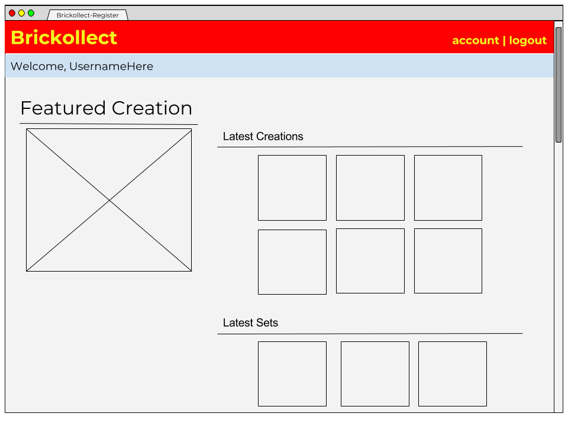

# Project Planning

## Wireframes
<<<<<<< HEAD
1. 
1. 
1. 

## Project Tracker
* [Pivotal Tracker](https://www.pivotaltracker.com/n/projects/2128316)
=======

(Include at least 3 wireframes here, adding images or files to your the repository as necessary. Format them as a bulleted/unordered list with links to the files.)

## Project Tracker

(Include a link to your public Pivotal Tracker project. Be sure you have user stories added for at least your first 2-week sprint.)
>>>>>>> 160fc341fd482f06ea926bc1f073e353d90b1918
